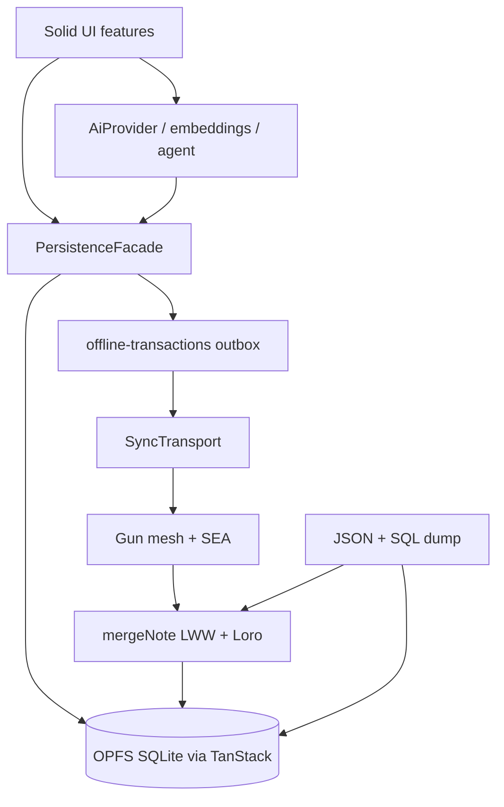

# Architecture

## Layer diagram

## Swap points

| Want to replace | Implement | Location |
| --- | --- | --- |
| Sync mesh | `SyncTransport` | [`src/shared/sync/transport.ts`](../src/shared/sync/transport.ts), [`gun-transport.ts`](../src/shared/sync/gun-transport.ts) |
| Local persistence | keep writes behind facade | [`src/shared/db/facade.ts`](../src/shared/db/facade.ts), [`client.ts`](../src/shared/db/client.ts) |
| Conflict policy | `mergeNote` + CRDT helpers | [`src/shared/sync/merge-note.ts`](../src/shared/sync/merge-note.ts), [`src/shared/db/crdt.ts`](../src/shared/db/crdt.ts) |
| AI engine | `AiProvider` | [`src/ai/types.ts`](../src/ai/types.ts), [`webllm-provider.ts`](../src/ai/webllm-provider.ts) |
| Embeddings | `EmbeddingProvider` | [`src/ai/embeddings/`](../src/ai/embeddings/) |
| Domain (notes → other) | schemas + facade + features | [`src/shared/db/schemas.ts`](../src/shared/db/schemas.ts), [`src/features/`](../src/features/) |
| Identity / space crypto | SEA pair + space key | [`src/shared/identity/`](../src/shared/identity/), [`src/shared/crypto/`](../src/shared/crypto/) |

## Invariants

1. **OPFS SQLite is source of truth.** Gun is transport only.
2. **All UI writes go through `PersistenceFacade`.**
3. **Remote apply and backup import share `applyRemoteMutations` + `mergeNote`.**
4. **Embeddings and conflict_log stay local** (not synced).
5. **Protocol mutations carry `v`; incompatible peers degrade sync to `outdated`.**
