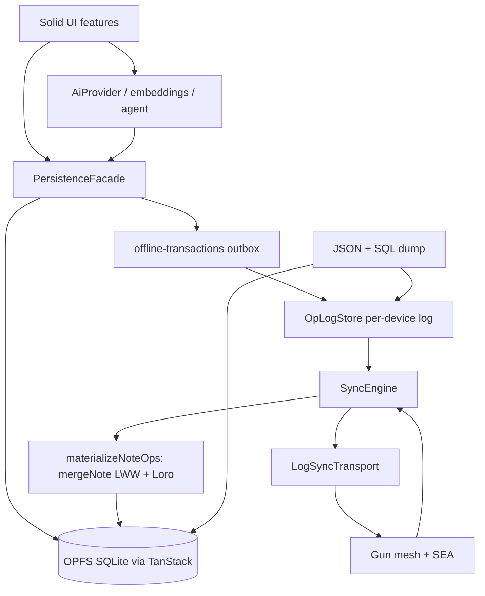

# Architecture

## Layer diagram

## Swap points

| Want to replace | Implement | Location |
| --- | --- | --- |
| Sync mesh | `LogSyncTransport` | [`src/shared/sync/transport.ts`](../src/shared/sync/transport.ts), [`gun-log-transport.ts`](../src/shared/sync/gun-log-transport.ts) |
| Op log storage | `OpLogPersistence` | [`src/shared/store/oplog-persistence.ts`](../src/shared/store/oplog-persistence.ts) |
| Local persistence | keep writes behind facade | [`src/shared/db/facade.ts`](../src/shared/db/facade.ts), [`client.ts`](../src/shared/db/client.ts) |
| Conflict policy | `mergeNote` + CRDT helpers, folded in `materialize.ts` | [`src/shared/sync/merge-note.ts`](../src/shared/sync/merge-note.ts), [`src/shared/db/crdt.ts`](../src/shared/db/crdt.ts), [`src/shared/store/materialize.ts`](../src/shared/store/materialize.ts) |
| AI engine | `AiProvider` | [`src/ai/types.ts`](../src/ai/types.ts), [`webllm-provider.ts`](../src/ai/webllm-provider.ts) |
| Embeddings | `EmbeddingProvider` | [`src/ai/embeddings/`](../src/ai/embeddings/) |
| Domain (notes → other) | schemas + facade + features + op payload schema | [`src/shared/db/schemas.ts`](../src/shared/db/schemas.ts), [`src/shared/oplog/payload.ts`](../src/shared/oplog/payload.ts), [`src/features/`](../src/features/) |
| Identity / space crypto | SEA pair + per-device signing key + space key | [`src/shared/identity/`](../src/shared/identity/), [`src/shared/crypto/`](../src/shared/crypto/) |

## Test layers

Each Vitest project is a layer, and the layer — not a comment in the file —
declares what is real and what is a stand-in. Put a new test in the highest
layer that can still express it deterministically.

| Layer | Project / tool | Real | Stand-in |
| --- | --- | --- | --- |
| Unit | `unit` (node) | one module | everything around it |
| Contract | `contract` (node) | a port **and every implementation of it** | whatever sits below the port |
| Integration | `integration` (node) | facade → outbox → op log → engine → materializer, 2-3 devices | transport (`FakeHub`), OPFS, browser |
| Component | `dom` (jsdom) | one Solid component | the rest of the stack |
| E2E | Playwright | everything: OPFS, service worker, real Gun wire, multiple tabs | nothing (except the WebLLM model) |

- **Contract** exists because a port with two implementations tested only
  through one of them is a port in name only. `OpLogPersistence` is held to
  [`oplog-persistence.contract.ts`](../src/shared/store/oplog-persistence.contract.ts)
  as both `MemoryOpLogPersistence` (what the unit layer runs on) and
  `CollectionOpLogPersistence` (what ships). The contract states the one
  difference between them rather than hiding it: **reads are eventually
  consistent after a write**, because TanStack confirms persisted writes
  asynchronously — which is exactly why `OpLogStore` keeps its own read index
  (see ADR-010's consequences).
- **Integration** exists because the interesting failures live between
  modules and across devices. The harness
  ([`src/testing/harness/`](../src/testing/harness/)) composes real production
  code into a `createVirtualDevice()`; its outbox stand-in deliberately
  reproduces `mutationFns.syncNotes` from `db/client.ts`, so a write that
  never reaches the log fails the layer instead of passing it.
- `src/testing/**` is test-only: no app module imports it, and it is excluded
  from coverage.
- The contract layer needs Node ≥ 23.4 (unflagged `node:sqlite`). On older
  Node it reports a visible skip rather than quietly covering nothing.

## Invariants

1. **OPFS SQLite is source of truth.** Gun is transport only.
2. **All UI writes go through `PersistenceFacade`.**
3. **Local writes append to the device's own op log (durable) before the offline transaction completes**, then publish; pulling remote state stays a background concern. Backup import shares the same `store.append` + `mergeNote` path as any remote op, under the engine's cross-tab lock.
4. **Embeddings and conflict_log stay local** (not synced).
5. **Every op carries `v`; a version this client can't ingest degrades sync status to `outdated` for that cycle** (recomputed every cycle — it does not latch). See [ADR-010](adr/010-per-device-op-log.md).
