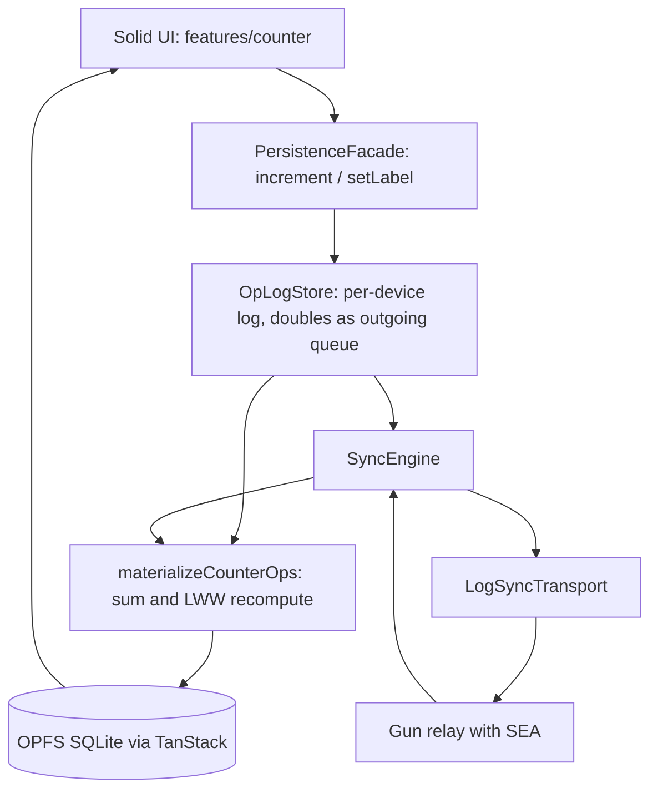

# Architecture

## 1. Purpose

This document is the map of the system: the layer diagram, the replacement
points, the test layers, and the invariants. The narrative — definitions,
protocol, responsibilities, dependency rationale, and the migration path —
is in [vision.md](vision.md).

## 2. Layer diagram

## 3. Replacement points

| To replace | Implement | Location |
| --- | --- | --- |
| Transport | `LogSyncTransport` | [`src/shared/sync/transport.ts`](../src/shared/sync/transport.ts), [`gun-log-transport.ts`](../src/shared/sync/gun-log-transport.ts) |
| Operation log storage | `OpLogPersistence` | [`src/shared/store/oplog-persistence.ts`](../src/shared/store/oplog-persistence.ts) |
| Local persistence | keep writes behind the facade | [`src/shared/db/facade.ts`](../src/shared/db/facade.ts), [`client.ts`](../src/shared/db/client.ts) |
| Merge policy | the recompute in `materialize.ts` | [`src/shared/store/materialize.ts`](../src/shared/store/materialize.ts) |
| Demonstration domain | schemas, payload kinds, materializer, UI | the four files listed in [vision.md, section 6](vision.md#6-domain-and-template-boundary) |
| Identity and space cryptography | relay credential pair, device signing key, space key | [`src/shared/identity/`](../src/shared/identity/), [`src/shared/crypto/`](../src/shared/crypto/) |

## 4. Migration direction

Since [ADR-011](adr/011-adopt-p2panda-direction.md), the replacement points
have a named destination: the transport, the operation log storage, and the
identity and cryptography rows map to p2panda crates along the thin-client
and broker path. The module-to-crate table is in
[ADR-010](adr/010-per-device-op-log.md); note the erratum in ADR-011 —
p2panda's wire encoding has been Postcard, not CBOR, since version 0.7.
What blocks each replacement, on both sides, is tracked in
[p2panda-gaps.md](p2panda-gaps.md). In-repository substitutes for the
frozen replacement points are out of scope; see the labels in
[BACKLOG.md](BACKLOG.md).

## 5. Test layers

Each Vitest project is a layer, and the layer — not a comment in an
individual file — declares which parts are real and which are substituted.
A new test belongs in the highest layer that can still express it
deterministically.

| Layer | Project or tool | Real | Substituted |
| --- | --- | --- | --- |
| Unit | `unit` (Node) | one module | everything around it |
| Contract | `contract` (Node) | a port and every implementation of it | whatever sits below the port |
| Integration | `integration` (Node) | facade, operation log, engine, materializer; two to three devices | transport (`FakeHub`), OPFS, browser |
| Component | `dom` (jsdom) | one Solid component | the rest of the stack |
| End-to-end | Playwright | everything: OPFS, service worker, real Gun wire, multiple tabs | nothing |

Notes on the two non-standard layers:

- The contract layer exists because a port with two implementations tested
  through only one of them is a port in name only. `OpLogPersistence` is
  held to
  [`oplog-persistence.contract.ts`](../src/shared/store/oplog-persistence.contract.ts)
  as both `MemoryOpLogPersistence` (used by the unit layer) and
  `CollectionOpLogPersistence` (used in production). The contract states
  the one difference between them explicitly: reads are eventually
  consistent after a write, because the persistence layer confirms writes
  asynchronously. This is also why `OpLogStore` keeps its own read index
  and merges flags monotonically; see the consequences sections of
  [ADR-010](adr/010-per-device-op-log.md) and
  [ADR-012](adr/012-counter-hello-world.md).
- The integration layer exists because the significant failures occur
  between modules and across devices. The harness
  ([`src/testing/harness/`](../src/testing/harness/)) composes production
  code into `createVirtualDevice()`; the facade drives the same store and
  engine surface that the application wires in `db/client.ts`, so a write
  that never reaches the log fails this layer. The two decisive cases live
  here and in the end-to-end suite: concurrent increments on two devices
  sum correctly, and increments from two tabs of one device sum correctly.

Operational notes:

- `src/testing/` is test-only code: no application module imports it, and
  it is excluded from coverage.
- The contract layer requires Node 23.4 or newer (unflagged `node:sqlite`).
  On older versions it reports a visible skip rather than silently covering
  nothing.

## 6. Invariants

1. SQLite in OPFS is the source of truth; Gun is a transport only.
2. All UI writes go through `PersistenceFacade`.
3. A write is one durable operation appended to the device's log, folded
   into state by the materializer, then published in the background. The
   log's `published` flag is the outgoing queue; the state row is only ever
   derived from the log, never written directly
   ([ADR-012](adr/012-counter-hello-world.md)).
4. The conflict log stays local; it is not synchronized.
5. Every operation carries a version field. A version this client cannot
   ingest degrades the synchronization status to `outdated` for that cycle;
   the status is recomputed every cycle and does not latch
   ([ADR-010](adr/010-per-device-op-log.md)).
