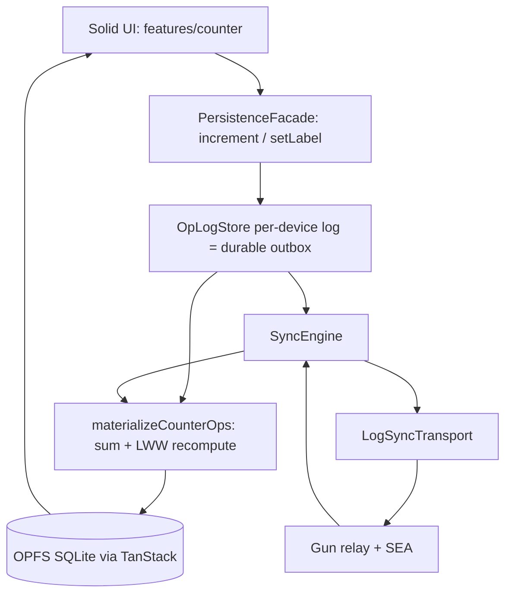

# Architecture

The narrative version — what local-first/P2P mean here, the protocol, the
responsibility table, and the road to p2panda — is [vision.md](vision.md).
This file is the map: diagram, swap points, test layers, invariants.

## Layer diagram

## Swap points

| Want to replace | Implement | Location |
| --- | --- | --- |
| Sync mesh | `LogSyncTransport` | [`src/shared/sync/transport.ts`](../src/shared/sync/transport.ts), [`gun-log-transport.ts`](../src/shared/sync/gun-log-transport.ts) |
| Op log storage | `OpLogPersistence` | [`src/shared/store/oplog-persistence.ts`](../src/shared/store/oplog-persistence.ts) |
| Local persistence | keep writes behind facade | [`src/shared/db/facade.ts`](../src/shared/db/facade.ts), [`client.ts`](../src/shared/db/client.ts) |
| Merge policy | recompute in `materialize.ts` | [`src/shared/store/materialize.ts`](../src/shared/store/materialize.ts) |
| Domain (counter → yours) | schemas + payload kinds + materializer + features | [`src/shared/db/schemas.ts`](../src/shared/db/schemas.ts), [`src/shared/oplog/payload.ts`](../src/shared/oplog/payload.ts), [`src/features/`](../src/features/) — the full recipe is [vision.md §5](vision.md#5-domain-split) |
| Identity / space crypto | SEA pair + per-device signing key + space key | [`src/shared/identity/`](../src/shared/identity/), [`src/shared/crypto/`](../src/shared/crypto/) |

### Where the swaps are headed

Since [ADR-011](adr/011-adopt-p2panda-direction.md) these seams have a named
destination: the sync mesh, op-log storage, and identity/crypto rows map to
p2panda crates along the thin-client + broker path (module→crate table in
[ADR-010](adr/010-per-device-op-log.md); note ADR-011's errata — p2panda's
wire encoding is Postcard since v0.7, not CBOR). What blocks each swap, on
both sides, is tracked in [p2panda-gaps.md](p2panda-gaps.md). Homegrown
replacements for the frozen seams are deliberately out of scope — see the
labels in [BACKLOG.md](BACKLOG.md).

## Test layers

Each Vitest project is a layer, and the layer — not a comment in the file —
declares what is real and what is a stand-in. Put a new test in the highest
layer that can still express it deterministically.

| Layer | Project / tool | Real | Stand-in |
| --- | --- | --- | --- |
| Unit | `unit` (node) | one module | everything around it |
| Contract | `contract` (node) | a port **and every implementation of it** | whatever sits below the port |
| Integration | `integration` (node) | facade → op log → engine → materializer, 2-3 devices | transport (`FakeHub`), OPFS, browser |
| Component | `dom` (jsdom) | one Solid component | the rest of the stack |
| E2E | Playwright | everything: OPFS, service worker, real Gun wire, multiple tabs | nothing |

- **Contract** exists because a port with two implementations tested only
  through one of them is a port in name only. `OpLogPersistence` is held to
  [`oplog-persistence.contract.ts`](../src/shared/store/oplog-persistence.contract.ts)
  as both `MemoryOpLogPersistence` (what the unit layer runs on) and
  `CollectionOpLogPersistence` (what ships). The contract states the one
  difference between them rather than hiding it: **reads are eventually
  consistent after a write**, because TanStack confirms persisted writes
  asynchronously — which is why `OpLogStore` keeps its own read index and
  why its flag merges are monotonic (see ADR-010's consequences and
  [ADR-012](adr/012-counter-hello-world.md)).
- **Integration** exists because the interesting failures live between
  modules and across devices. The harness
  ([`src/testing/harness/`](../src/testing/harness/)) composes real
  production code into `createVirtualDevice()` — the facade drives the same
  store/engine surface the real app wires in `db/client.ts`, so a write that
  never reaches the log fails the layer instead of passing it. The two
  definitive cases live here and in e2e: concurrent increments on two
  devices **sum**, and increments from two tabs of one device **sum**.
- `src/testing/**` is test-only: no app module imports it, and it is
  excluded from coverage.
- The contract layer needs Node ≥ 23.4 (unflagged `node:sqlite`). On older
  Node it reports a visible skip rather than quietly covering nothing.

## Invariants

1. **OPFS SQLite is source of truth.** Gun is transport only.
2. **All UI writes go through `PersistenceFacade`.**
3. **A write is one durable op appended to this device's log, folded into
   state by the materializer, then published in the background.** The log's
   `published` flag is the outbox; the state row is only ever derived from
   the log, never written directly ([ADR-012](adr/012-counter-hello-world.md)).
4. **conflict_log stays local** (not synced).
5. **Every op carries `v`; a version this client can't ingest degrades sync
   status to `outdated` for that cycle** (recomputed every cycle — it does
   not latch). See [ADR-010](adr/010-per-device-op-log.md).
